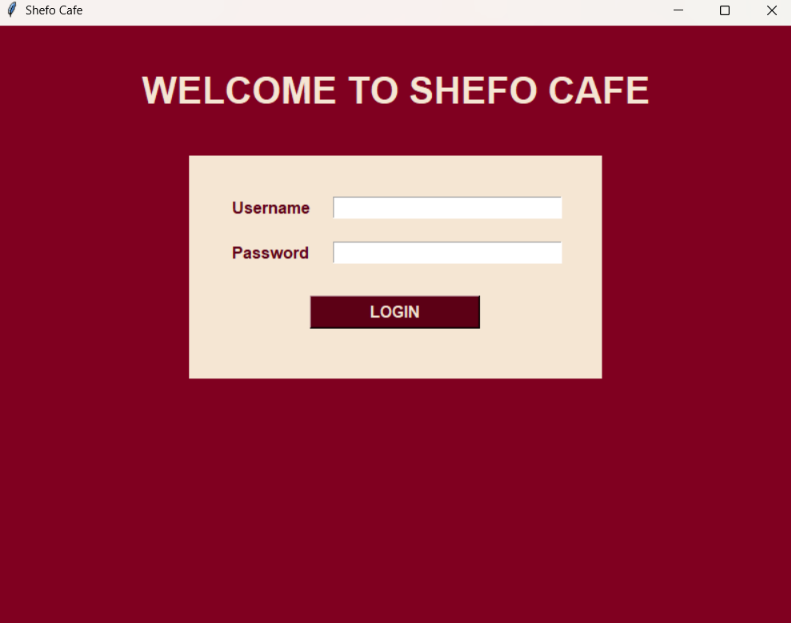
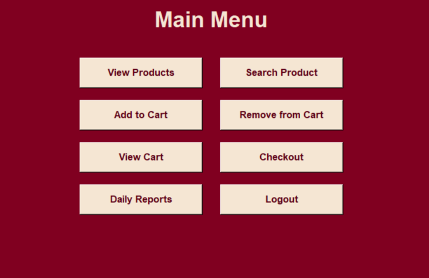
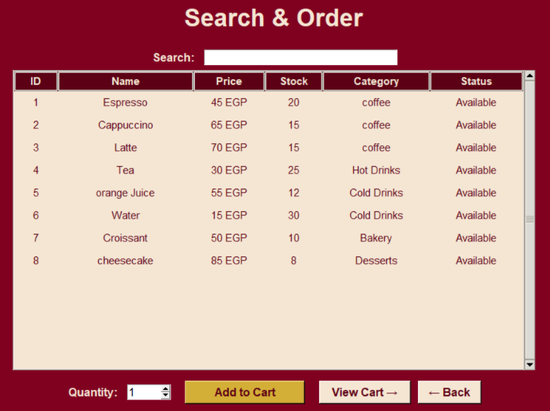
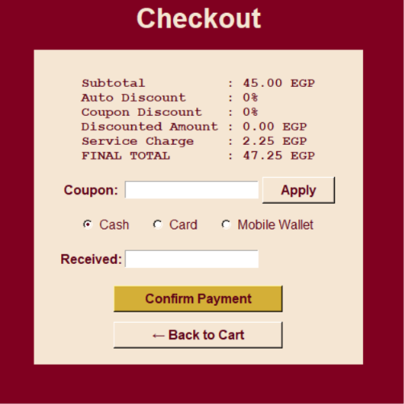

# ☕ Shefo Cafe System

A café point-of-sale (POS) desktop app built with **Python** and **Tkinter**, designed around **object-oriented programming** with a clean separation between business logic and the user interface.

## Screenshots

| Login | Main Menu |
|---|---|
|  |  |

| Search & Order | Checkout |
|---|---|
|  |  |

## Features

- Login screen with credential validation
- Product list with stock status highlighting (low stock / out of stock)
- Live product search while typing
- Shopping cart: add items, remove items, automatic stock updates
- Checkout with:
  - Automatic discounts based on order total
  - Coupon codes with validation
  - Service charge
  - Cash (with change calculation), card, or mobile wallet payment
- Printable-style receipt
- Daily report: total sales, average order value, sold products, low/out-of-stock items, order history

## Business Rules

| Rule | Value |
|---|---|
| Auto discount | 5% for orders ≥ 300 EGP, 10% for orders ≥ 500 EGP |
| Coupons | `CAFE10` (10%), `STUDENT5` (5%), `WELCOME3` (3%) |
| Maximum combined discount | 15% |
| Service charge | 5% (applied after discount) |

## Project Structure

```
shefo-cafe-system/
├── cafe_system.py    # OOP logic: Product, Cart, CartItem, Coupon, Order, CafeManagementSystem
├── cafe_gui.py       # Tkinter interface (reads from the OOP classes, no business logic)
└── screenshots/
```

## OOP Design

- **Product**: stock management and stock status
- **Cart / CartItem**: cart operations and subtotals
- **Coupon**: coupon validation and discount lookup
- **Order**: discount, service charge, and payment calculation
- **CafeManagementSystem**: ties everything together (login, products, orders, reports)

The GUI never calculates prices or discounts itself; it only calls the classes above and displays the results.

## Getting Started

**Requirements:** Python 3.8+ (Tkinter is included with the standard Python installation).

```bash
git clone https://github.com/mohamed10sherif/cafe_system.git
cd shefo-cafe-system
python cafe_gui.py
```

**Demo login (for testing only):**

- Username: `admin`
- Password: `cafe123`

## Possible Improvements

- Persistent storage with SQLite
- Product management screen (add / edit / delete)
- Order history filtered by date
- Unit tests for the business logic

## Author

Built as a learning project to practice OOP and GUI development in Python.